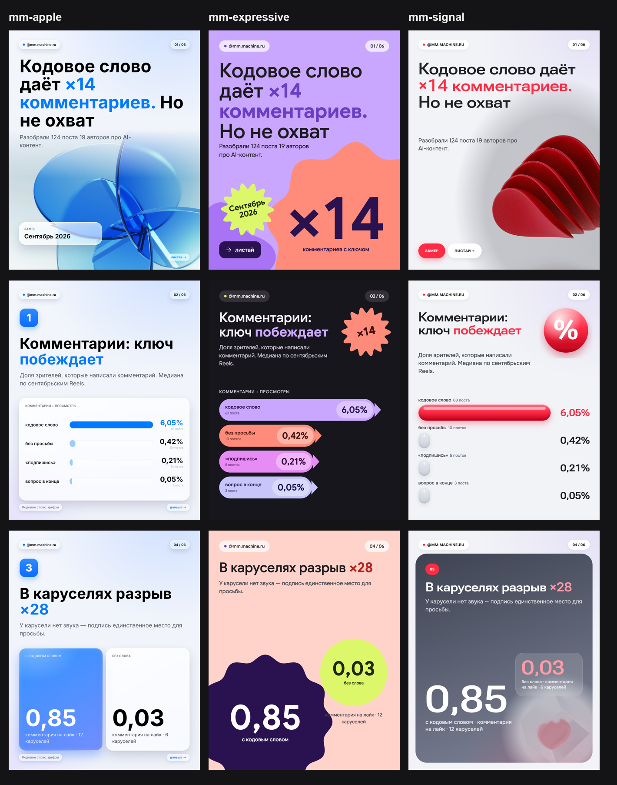

# MM Carousels

Пайплайн Instagram-каруселей для @laz.creator: **JSON-спека → HTML → PNG 1080×1350**.
Три дизайн-системы на одной разметке — любую спеку можно собрать в любой из них:

| Система | Язык | Шрифт | Иконки |
|---|---|---|---|
| **mm-apple** (основная) | Apple HIG + Liquid Glass | Inter | Tabler |
| **mm-expressive** | Material 3 Expressive (Google) | Google Sans | Material Symbols Rounded |
| **mm-signal** | по мотивам айдентики МТС 2023 | Roboto Flex (wdth 140) + Onest | Tabler |



Лёгкий формат «одна мысль на слайд» во всех трёх.

Утверждено Умаром 23.09.2026. Всё, что было раньше (Neeraj Proof Guide, синий бенто, «тяжёлые» карусели с цифрами), отклонено и в репозиторий не входит.

## Быстрый старт

```bash
npm run setup                                   # Playwright + Chromium (один раз)
python3 scripts/build.py specs/mm-5-phrases-chatgpt.json
node scripts/render.mjs releases/mm-5-phrases-chatgpt
open releases/mm-5-phrases-chatgpt/contact-sheet.png
```

Нужны Node 20+ и Python 3 (только стандартная библиотека).

## Как создаётся карусель

1. **Тема и механика.** Берём приём из разбора сильных постов авторов (список, чек-лист признаков, интрига с разгадкой на 2-м слайде). Чужие тексты не копируем — только механику; все формулировки свои.
2. **Спека** `specs/<id>.json` — весь текст карусели (см. ниже). Кликбейтный, но честный заголовок: обещание раскрывается к 2-му слайду. 6–8 слайдов.
3. **Рендер обложки.** Качественный 3D-рендер на нейтральном фоне с Unsplash (только бесплатные, с подтверждения Умара) → `releases/<id>/assets/cover-render.jpg` + `cover-render.json` (источник, автор, лицензия, дата).
4. **Сборка** `scripts/build.py` → `releases/<id>/source.html` + `mm-apple.css`, `liquid.js`, шрифты, ассеты.
5. **Рендер** `scripts/render.mjs` → `01.png…NN.png`, `contact-sheet.png`, `index.html`. `liquid.js` строит преломление стекла прямо в Chromium.
6. **Проверка глазами** каждого PNG: нет обрезанного текста, контраст, объект обложки читается.
7. **Публикация** — только после «ок» Умара; подпись берётся из `caption.txt`.

## Спека карусели

```jsonc
{
  "handle": "@laz.creator",
  "title": "5 фраз для ChatGPT",                      // для подписи внизу слайдов
  "cover": {
    "title_html": "5 фраз, после которых <b>ChatGPT</b> перестаёт лить воду",  // <b> = синий акцент
    "sub": "Копируй в любой запрос.",
    "chip_lbl": "сохрани", "chip": "Пригодится в каждом чате",                  // стеклянная плашка на рендере
    "render": { "w": 2200, "left": -90, "top": 640 }                             // рендер шире кадра, уходит за правый нижний край
  },
  "items": [                                            // слайды-пункты, один из видов:
    { "h": "Пусть сначала <b>спросит</b>", "p": "…",    // заголовок + одна строка
      "ctx": "…", "quote": "…", "reply": "…" },         //   чат: серый контекст → синяя фраза → серый пример ответа
    { "h": "…", "p": "…", "demo": "<div class=\"m-btn\">Начать</div>", "bad_lbl": "признак",
      "lbl": "вместо", "quote": "…" },                  //   мини-макет «было» + синяя карточка «вместо»
    { "h": "…", "p": "…", "lbl": "…", "quote": "…" }    //   просто крупная фраза
  ],
  "final": { "title_html": "Шпаргалка: <b>5 фраз</b>", "list": ["…"], "save_lbl": "…", "save": "Сохрани себе" },
  "caption": "подпись к посту"
}
```

В `demo` можно вставлять иконки: `{{icon:player-play}}` (имя файла из `assets/icons/tabler`).
Готовые мини-макеты: `.m-grad` (градиент), `.m-emoji`, `.m-cards`, `.m-btn`, `.m-text`, `.m-photo`, `.m-ui` + `.m-url` + `.m-cta` (шаг интерфейса), `.m-thumbs`, `.m-cite`.

## Как выбрать систему

```bash
python3 scripts/build.py specs/<id>.json                 # система из спеки ("design"), по умолчанию mm-apple
python3 scripts/build.py specs/<id>.json mm-expressive   # та же спека в другой системе → releases/<id>--mm-expressive
node scripts/render.mjs releases/<id>--mm-expressive
```

Система — папка `design-system/<name>/`: `system.json` (стили, скрипты, шрифты, набор иконок, таблица замены имён иконок), `style.css`, скрипты.
Разметка слайдов общая (`scripts/build.py`), системы только перекрашивают и перекраивают её классы.

## Дизайн-система mm-apple

Файлы `design-system/mm-apple/style.css` (4 секции, порядок важен) + `liquid.js`.

**Принципы** (Apple HIG: clarity, deference, depth; Liquid Glass): контент ведёт, стекло не мешает читать, иерархия размером и отступами, а не цветом.

| | |
|---|---|
| Фон | `#F3F6FC → #EEF1F8`, мягкий голубой и лиловый свет по углам. Никаких декоративных кругов и сеток |
| Акцент | systemBlue `#007AFF`; тёмная карточка `#1C1C1E`; вторичный текст `rgba(60,60,67,.62)` |
| Карточки | сгруппированные, радиус 38 px, сетка 6 колонок, зазор 18 px |
| Стекло | полупрозрачная белая тонировка, блик сверху, светящийся ободок, тень; `liquid.js` — преломление фона по краям (SVG-фильтр в `backdrop-filter`) |
| Шрифт | **Inter** (OFL), вес 400–800. Межбуквенное расстояние никогда не отрицательное; заголовки 72–98 px, межстрочный 1.04–1.1; текст 26–32 px, 1.42 |
| Иконки | **Tabler** (MIT) в синих скруглённых квадратах, как в «Настройках» iOS (`.sym`); галочки — заливной `circle-check-filled` (`.ok`) |
| Обложка | 3D-рендер крупнее кадра, объект уходит за правый нижний край, верх растворяется маской; заголовок сверху, стеклянная плашка поверх объекта |
| Пункты | номер в синей плашке, крупный заголовок, одна строка; середина никогда не пустая: чат как в «Сообщениях», мини-макет или шаг интерфейса |
| Финал | шпаргалка с галочками на всю высоту + синяя карточка «Сохрани» |

## Дизайн-система mm-expressive (визуальный язык Material 3 Expressive)

Снято с исследовательских инфографик и концептов Google Design (design.google/library/expressive-material-design-google-research). Своя раскладка слайдов: `design-system/mm-expressive/template.py`.

| Элемент | Как сделано |
|---|---|
| Цветовые поля | слайд целиком залит одним тоном: лаванда `#C9A7FF`, светлая `#F6F0FF`, тёмная `#18161D`, лососевая `#FFD2CA`, глубокий фиолетовый `#2A1250`; темы чередуются по слайдам |
| Акценты | лосось `#FF8C7A`, орхидея `#E88CF5`, перивинкл `#C7C5FA`, лайм `#DDF76B` (наклейки и FAB) |
| Типографика | Google Sans (OFL), Display 112 px / Headline 76–80 px, emphasized 700 для акцента, трекинг 0 |
| Формы | «печенье» 9/12, «клевер», «взрыв», «солнце» — сгенерированы формулой, не файлы Google |
| Обложка | огромное «печенье» с гигантским числом за правым нижним краем + лаймовая наклейка-взрыв + Extended FAB «листай» |
| Пункт | номер в «клевере», телефон с интерфейсом (чат или макет) уходит за нижний край, лаймовая карточка-вывод |
| График | столбики-пилюли разных цветов со стрелкой и значением в капсуле + наклейка с главным числом (как их research-чарты) |
| Сравнение | два числа в формах разного масштаба: большое «печенье» и лаймовый круг |
| Финал | контурный паттерн компонентов (как фон их дизайн-кита), список M3 с иконками, лаймовый Extended FAB |
| Иконки | Material Symbols Rounded, FILL 1 (Apache-2.0) |

**Не используем:** логотип и четырёхцветку Google, иконки продуктов, Product Sans, слова Google / Material в подписях (`licenses/GoogleSans-TRADEMARKS.md`).

## Дизайн-система mm-signal (визуальный язык по мотивам МТС 2023)

Снято с mts.ru и кейсов ONY / UtterDesign. Своя раскладка: `design-system/mm-signal/template.py`.

| Элемент | Как сделано |
|---|---|
| Фон | холодный светло-серый `#F2F3F7` с лавандовым светом в углу |
| Материалы | красный глянцевый пластик + матовое стекло: рендеры `assets/renders/mts-style` (Unsplash) и свои SVG-объекты с глянцем (щит, «%», облако чата, молния, галочка) |
| Цвет | свой красный `#FF2B45` (не `#FF0032`), графит `#3E4352 → #7F8599`, текст `#1D2023` |
| Типографика | Roboto Flex `font-stretch:125%` 560 — широкий гротеск строчными, интервал 1.02; мелкий широкий капс для меток; текст Onest |
| Обложка | крупный красный 3D за правым нижним краем, красная и белая пилюли |
| Пункт | графитовая промо-плитка во весь слайд: красная пилюля-номер, широкий заголовок, глянцевый объект, диалог в пузырях матового стекла, белая круглая кнопка-стрелка |
| График | глянцевые капсулы (главная — красная) + глянцевый значок «%» |
| Сравнение | огромные широкие цифры на плитке + стеклянная карточка |
| Финал | белые карточки с глянцевыми галочками, красная кнопка-пилюля во всю ширину со стрелкой |

**Не используем:** логотип-квадрат и буквы М/Т/С по углам, красный `#FF0032` (товарный знак), шрифты MTS Sans / Normalidad, их рендеры, иконки, название компании.

## Шаблон своей системы

`design-system/<name>/` = `system.json` + `style.css` + `template.py` (функция `render(spec, ctx)` возвращает список `<section class="slide">`). Спека одна для всех систем: `chart` (столбики), `stat` (два числа), `reply` (чат), `demo` (макет), `quote`.

## Ассеты и лицензии

| Что | Откуда | Лицензия | Где |
|---|---|---|---|
| Шрифт Inter | rsms/inter (из marketing-kit) | SIL OFL 1.1 | `assets/fonts/Inter`, `licenses/Inter-OFL.txt` |
| Шрифт Google Sans | google/fonts `ofl/googlesans`, урезан до кириллицы+латиницы | SIL OFL 1.1, без RFN; «Google Sans» — товарный знак | `assets/fonts/GoogleSans`, `licenses/GoogleSans-*.txt/md` |
| Шрифт Roboto Flex | google/fonts `ofl/robotoflex`, урезан | SIL OFL 1.1 | `assets/fonts/RobotoFlex`, `licenses/RobotoFlex-OFL.txt` |
| Шрифт Onest | из marketing-kit | SIL OFL 1.1 | `assets/fonts/Onest`, `licenses/Onest-OFL.txt` |
| Рендеры mts-style (4 шт.) | Unsplash | Unsplash License | `assets/renders/mts-style/*.json` |
| Иконки Material Symbols Rounded (31 шт., fill) | google/material-design-icons | Apache-2.0 | `assets/icons/material-rounded`, `licenses/MaterialSymbols-Apache-2.0.txt` |
| Иконки | Tabler Icons (подмножество, 159 шт.) | MIT | `assets/icons/tabler`, `licenses/Tabler-MIT.txt` |
| 3D-иконки для макета «эмодзи» | Microsoft Fluent Emoji 3D | MIT | `assets/3d/fluent`, `licenses/FluentEmoji-MIT.txt` |
| Рендеры обложек | Unsplash (бесплатные) | Unsplash License | `releases/<id>/assets/cover-render.*`, `licenses/Unsplash.md` |

**Не используем никогда:** шрифты SF Pro / SF Compact / New York, SF Symbols, эмодзи Apple — по лицензии Apple они только для интерфейсов приложений на платформах Apple. Twemoji — только с атрибуцией, поэтому не берём. Открытые наборы в формате SF Symbols (OrchardKit/open-symbols) — это те же Tabler/Lucide/Heroicons, лицензия исходного набора.

**Контент:** не вкладываем выдуманные цитаты в уста реальных людей; цифры в постах — только проверенные.

## Выпуски

| id | Тема | Механика |
|---|---|---|
| `mm-5-phrases-chatgpt` | 5 фраз, после которых ChatGPT перестаёт лить воду | список фраз, чат-примеры |
| `mm-ai-site-tells` | Сайт, который сделала нейросеть, видно за 3 секунды | чек-лист признаков, мини-макеты |
| `mm-ask-hormozi` | Задай вопрос Хормози. Он ответит. Бесплатно (NotebookLM) | интрига → разгадка, шаги интерфейса |

Статус всех трёх: ждут публикации (основная система mm-apple). Инфографика `mm-keyword-infographic` и `mm-5-phrases-chatgpt` собраны во всех трёх системах (`releases/<id>--<system>`). Перед выпуском `mm-ask-hormozi` пройти шаги NotebookLM руками и сверить названия кнопок.

## Дизайн-система mm-reels (язык наших рилсов)

Перенос визуального языка `MM/reels/_kit` (DESIGN.md) в карусель 1080×1350.

| Элемент | Как сделано |
|---|---|
| Фон | чистый #F5F5F7 с мягким светом сверху, без пятен |
| Ведущий | мемоджи Умара (`assets/memoji`: think, oops, laptop, wink, swear). Обложка: think крупно за правым нижним краем. Пункты: laptop в стеклянной плашке ведущего, oops/swear как реакции |
| Обложка | капс-хук Inter 850 с синей плашкой на одном слове, медальон с кольцом иконок (как hook-rings) |
| Пункт | матовая карта: иконка iOS, счётчик «N из 5», красная пилюля «нельзя», почему, синяя строка «что делать»; ниже пример переписки «так пишут / так лучше»; внизу капс-субтитр |
| Финал | чек-лист, карточка канала ИИшница @iishnitsa_nazavtrak, стеклянная пилюля «Напиши в комментариях ИИШНИЦА» |
| Текст | без —, «», …, ×, → (правило публикуемых текстов) |

Спека: `specs/mm-nelzya-v-chatgpt.json` (поля `host`, `cover.hook/ring/medal/memoji`, `items[].icon/title/why/do/bad/good/say/react`, `final.list/keyword/say`). Слова в `[скобках]` получают синюю плашку.

## Библиотека ассетов `lib/`

Общая папка для каруселей и рилсов: мемоджи, 3D-стикеры Fluent (MIT) и 3dicons (CC0), фото Unsplash, 3D-рендеры, скрины сайтов, логотипы, иконки Tabler. Каждый файл описан в `lib/manifest.json` с лицензией и источником, подробности в `lib/README.md`. В спеке `mm-reels` ассет берётся по id: `"sticker": "fluent/fire"`, `"photo": "photo/man-panic-laptop"`.

**Мемоджи в `lib/memoji` — личный аватар автора.** Они лежат здесь, чтобы репозиторий собирался, но в своих проектах их не используйте.

## Выпуски mm-reels (25.09.2026)

`releases/<id>/` для спек из `specs/` с `"design": "mm-reels"`: 17 каруселей, в том числе профессиональные (`mm-pro-*`: подписки, контекст Claude Code, экономия лимитов, Claude Code / Codex / Cursor). Цифры в них по официальным страницам на 25.09.2026, ссылки в поле `sources` каждой спеки.
